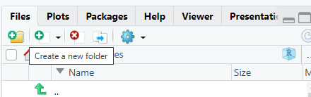

```{r setup, include=FALSE}
knitr::opts_chunk$set(echo = TRUE)
```

Goal: Practise navigating project folders using relative paths and the here() package.

For this exercise, you will need to first create an R Project. You can call it whatever makes sense to you.

**Task 1:** Create a folder called "data" inside your project. You can create it by clicking on "New Folder" in your Files tab.



Now, create a simple and small CSV file using any spreadsheet software (Excel, Numbers, Sheets, etc.). Call it "example.csv" and save it into your data folder.

Here is an example of the contents of your CSV file:

``` csv
name,score
Alice,10
Bob,15
Cara,12
```

**Task 2:** Look at the following absolute path example (replace "your-name" with your own user folder). Why is this bad practice?

"C:/Users/your-name/Documents/my-project/data/example.csv"

**Task 3:** Use `here::here()` to construct the correct path to "example.csv". Store it in an object called `data_path`. HINT: you want something like `here::here("data", "example.csv")`

```{r}
data_path <- "???"
```

**Task 4:** Use `read.csv(`) and `data_path` to read the CSV into R. Store it in an object called `scores`.

```{r}
scores <- "???"
```

**Task 5:** Print out the scores data frame to check it loaded correctly. Also, run `str(scores)` to see its structure.

```{r}
# Your code here
```

**Task 6:** Create a folder called "results" in your project. Save the scores data frame to that folder as "scores_clean.csv". HINT: try something like `write.csv(scores, here::here("results", "___"), row.names = FALSE)`.

```{r}
# Your code here
```

**Task 7:** If you zip up your project and send it to another student, will your code still run without changes? Explain why or why not.

**Tip:** You can create a folder by using `dir.create(here::here("results"))` and delete them with `unlink(here::here("results"), recursive = TRUE)`.
