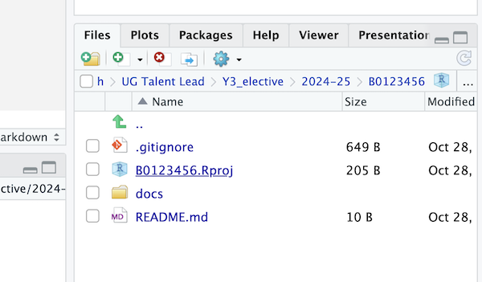
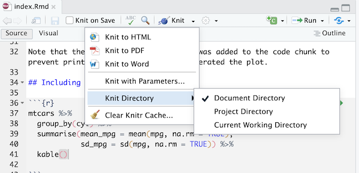
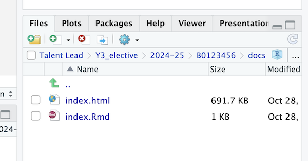
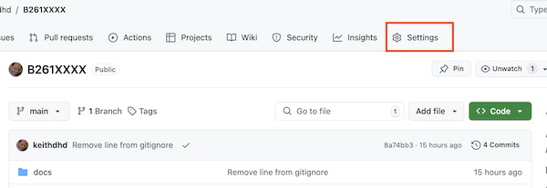
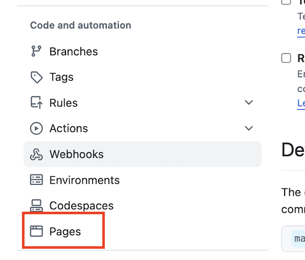
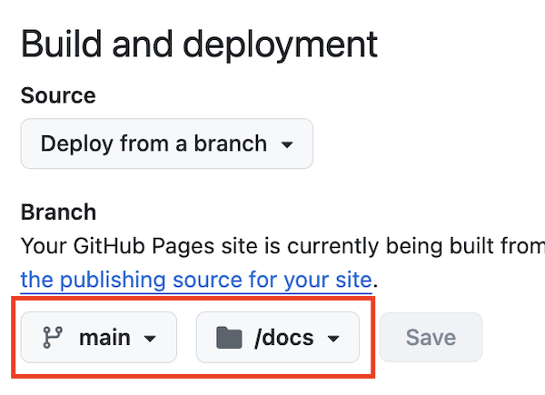

## Thursday

------------------------------------------------------------------------

## Friday

For your programming assignment, we would like you to host an R Markdown knitted HTML file on Github pages. In these instructions, you will set up the repo and folder structure for the assessment. You will be writing your assessment in an R Markdown file called `index.Rmd`.

You will need to create a new repository on Github for your assignment. **Please use your exam number as the name of your repository.** For example, "B123456".

Follow the instructions below to see how it's done!

### Create and initiate your assessment repository and directory

1.  Create a new repository on GitHub.com. Use your exam number as the name of the repository.

    -   Make sure to select the following options:
        -   Select `Public`
        -   Check `Add a README file`
        -   Add a .gitignore template: R
    -   Click the green `Create repository` button

2.  You will be taken to the main page of your new repository

3.  Click the green `Code` button

4.  Copy the HTTP link to the repository

5.  Open RStudio, create a new project in the usual way we do it in this course (from Version Control). Remember to create a new directory for this project (the directory name will be your student number), and save this directory within your `data-science` folder.

### Tweak the .gitignore file

1.  The `.gitignore` file contains a list of everything that will **not** be pushed up to Github. Open the `.gitignore` file within RStudio. Delete the lines in the file that look like this (if they are there):

```         
# pkgdown site
docs/
```

2.  While we're at it, let's also add a `data` folder to `.gitignore` - this means that anything you put in that folder will not be synced with GitHub. It's useful for working with large data files that would take a long time to sync. To do this, type the following at the bottom of your `.gitignore` file:

```         
# data folder
data/
```

3.  Save and close the `.gitignore` file

### Set up the folder structure for creating your website

1.  Still working in RStudio, create a new folder called `docs` inside your project directory. This is where you will save your R Markdown and HTML files.



2.  Now, create a new R Markdown file. It will contain some demo Markdown content - please keep it there and don't change any of the content just yet. Make the title `Assessment` and save it as `index.Rmd`in the `docs` folder.

3.  Set the Knit directory to `Document Directory`



4.  Knit the `index.Rmd` file to HTML. **Make sure you save the HTML file as index.html in your docs folder**. Github Pages will look for a file called `index.html` in the docs folder to make your page so this is important.



5.  In the Git tab of your RStudio, tick all the boxes next to file/folder names, and click `Commit`. Add a commit message (e.g. "initial commit"). Click on the `Commit` button underneath your message and then click on `Push` to push your new files to Github.

### Set up the website itself

1.  Go to GitHub.com to set up the GitHub pages features. On your Github repo page, go to `Settings`. Then click on the `Pages` link on the left hand side (about half-way down).





2.  In the `Build and deployment` section, select the `main` branch and the `docs` folder. Click on `save`. GitHub will generate a URL and display it at the top of the page. This is the address of your Github page! It may take a minute or so to appear, so wait a little bit and then try refreshing the page. Your website address will be similar to [`https://edinkasia.github.io/B123456/`](https://edinkasia.github.io/B123456/) where your Github username is the first part and the repo name is the last part.



3.  The URL of your website is a bit tricky to find, so we recommend putting it in the README section of your GitHub repo. This is how to do it:

-   Copy the URL of your website (it should still be visible from the previous step)
-   Go to the repo main page on github.com, click on the pencil icon on the top-right of your README section, and paste the URL into the text editor window.
-   Click the green `Commit changes` button. Add a commit message and click `Commit changes` to save.
-   Go back to the main page of your repo to check that your URL appears as you'd like it to.

### Updating your Github Page

As you work on your assessment, it's a good idea to save and Knit often and push to Github often.

To try this out, go to RStudio and pull from GitHub (this is because you have made changes to the README directly on github.com, and you don't have them saved locally yet). Then, make a small change in your .Rmd file - for example, add another plot, or change the existing plot to make it in ggplot2.

Then do the following (this is the flow you'll need to follow every time you make some changes):

1.  Save your R Markdown file and knit it into HTML. Make sure the new `index.html` is in your `docs` folder.
2.  Commit and then push your changes to GitHub, using the Git tab in your RStudio.
3.  Github Pages will automatically update, although it can take a few minutes.
4.  You can simply refresh your website (e.g. [`https://edinkasia.github.io/B123456/`](https://edinkasia.github.io/B123456/)) to see the changes after a few minutes.

Attribution: [click here](https://mbounthavong.com/blog/2022/7/30/hosting-a-r-markdown-html-file-on-a-github-page) to see the page that these instructions were based on, courtesy of Mark Bounthavong
